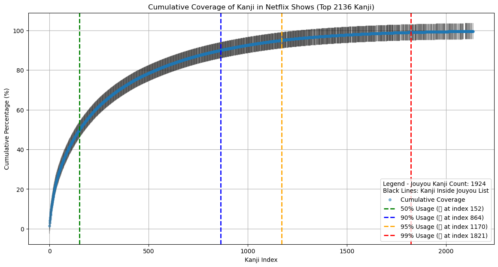
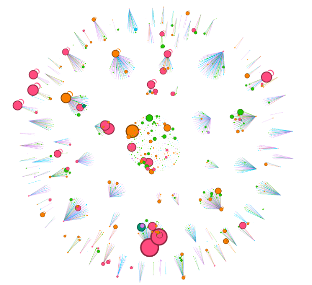
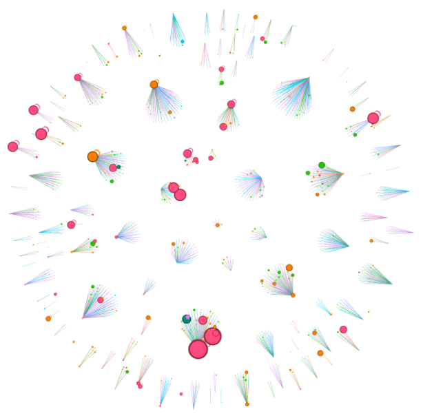
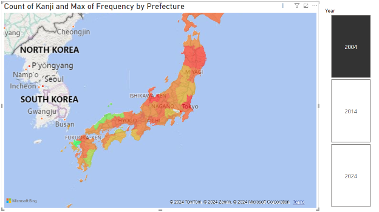
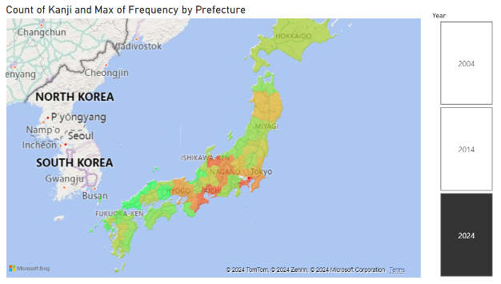
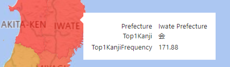

# Kanji Analysis on Netflix Subtitles

This repository contains the data and scripts used for assisting in understanding the frequency and importance of Japanese kanji characters used in Netflix shows. The goal is to determine which kanji should be learned first to maximize comprehension with minimal effort.

## Project Overview

### Japanese Kanji Frequency
#### Description
In this project, I analyzed the most frequently used kanji characters in Japanese Netflix subtitles. Our analysis revealed that learning a small subset of kanji provides significant understanding. The cumulative coverage graph shows that knowing just 152 kanji covers 50% of all kanji used in Netflix content. To achieve 99% comprehension, one needs to learn 1821 kanji.

#### Key Findings
- **50% Usage:** 152 kanji
- **90% Usage:** 864 kanji
- **95% Usage:** 1170 kanji
- **99% Usage:** 1821 kanji

#### Limitations
- The black bars in this visualizaiton represent kanji which are in the Jouyou list (government approved top 2100 kanji). This is not a great use as its not precise and also does not make any utility of color, width, or length. Ideally I should have made the data points a different color if it was in Jouyou kanji list or not.

### Kanji Network Visualization with Gephi
#### Description
Using Gephi, I created a network visualization showing the relationships between kanji based on their radicals. This helps illustrate how learning one kanji can aid in learning others with shared components. You can view various "islands" of kanji which have related elements. Each node represents a kanji, the size represents its frequency, and the color represents the kanjis JLPT level (0-5).

#### Visualizations
- **Figure 1.1:** Force-view layout showing connected nodes.  

- **Figure 1.2:** Filtered view with nodes having more than one edge.  

#### Limitations
- Each kanji was only assigned one single radical, whereas many kanji are compounds of multiple radicals. This results in less connected "islands."
- Every kanji contains radicals, but not every radical is a kanji. Since the nodes in the network are represented by kanji, some radicals end up being left out, resulting in some kanji appearing to have no edges, whereas they really do have edges, they just arent displayed.

### Regional Kanji Usage Analysis
#### Description
By analyzing kanji usage across different regions and prefectures in Japan using data from Google Trends. This geospatial analysis helps understand regional variations in kanji learning priorities and patterns over time.

#### Demo: PowerBI
Using PowerBI, I created interactive map visualizations showing kanji similarity across prefectures for different years. The maps are colored based on the similarity of kanji usage compared to our original dataset using spearman or tau similarity. I also created custom measures and tables to add hover over functionality making it easy to hover the mouse over a prefecture and view that specific prefectures top kanji and its frequency.

- **Figure 2.1:** 2004 Japan per-prefecture similarity to most used kanji.  

- **Figure 2.2:** 2024 Japan per-prefecture similarity to most used kanji.  

- **Figure 2.3:** Per-prefecture hover details example.  

#### Credit
Retrieving google trends data and calculating similarities goes to classmate and friend Theo whose GitHub can be found [here](https://github.com/Voyager916).

## Data
The `data` directory contains CSV files with kanji frequency data, and the PowerBI file used for geospatial analysis.

## Scripts
The `scripts` directory contains Python and Jupyter notebook files used for data aggregation and visualization.

## Gephi
The `gephi` directory contains the Gephi project file used for network visualizations.

# Conclusions
While not enough data visualizations, and a few improvements to be made, it seems from this data the best route of learning kanji to fluency would be to aim to learn 1821 kanji (vs. Jouyou 2100 kanji), and study kanji that share radicals with a large amount of other kanji first. In the future it would be valuable to include each kanjis entire set of radicals, rather than just one radical. This way, we could learn in an order that builds off of previously known information only.